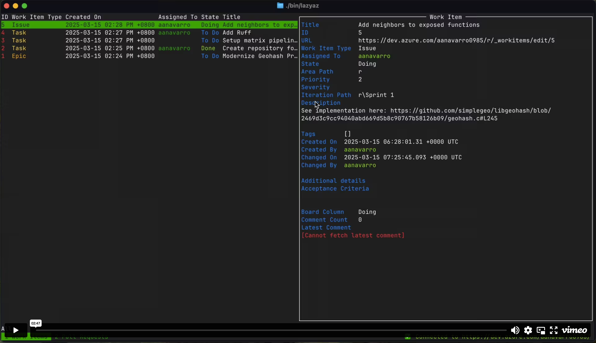

# LazyAZ

A terminal-based UI application for interacting with Azure DevOps, built with Go.

[](https://vimeo.com/1066217264/acd0fb1d6b "Lazyaz demo - Click to Watch!")

## Overview

LazyAZ provides a convenient terminal interface to interact with Azure DevOps services. It allows you to:

- View work items
- View pull requests
- View pipeline runs
- Export to templates
- Open in browser

## Prerequisites

- Azure DevOps account
- Azure CLI installed with the Azure DevOps extension

## Installation

### Homebrew

Mac and Linux users with Homebrew installed can install `lazyaz` using the following command:

```bash
brew tap aldnav/tap
brew install aldnav/tap/lazyaz
```

### Others

Head on to [releases page](https://github.com/aldnav/lazyaz/releases) and download the binary for your platform.

### Get started

```bash
az login
# If you are having trouble signing in, try this:
# az login --allow-no-subscriptions
# az login --tenant-id <tenant-id>  # From one of the tenant IDs of the previous command
az devops configure --defaults organization=https://dev.azure.com/your-organization
az devops configure --defaults project=your-project
lazyaz  # Or ./lazyaz.exe if on Windows
```

## Development Setup

1. Clone the repository:

   ```bash
   git clone https://github.com/aldnav/lazyaz.git
   cd lazyaz
   ```

2. Install dependencies:

   ```bash
   go mod download
   ```

## Authentication

Make sure you have logged in with Azure CLI before using the application:

```bash
az login
az devops configure --defaults organization=https://dev.azure.com/your-organization
az devops configure --defaults project=your-project
```

Reference to `az cli` : <https://learn.microsoft.com/en-us/azure/devops/cli/log-in-via-pat?view=azure-devops&tabs=windows>

### Environment Variables

While the application now primarily uses Azure CLI for authentication, you can still set the following environment variable:

| Variable | Description | Required |
|----------|-------------|----------|
| AZURE_DEVOPS_ORG | Your Azure DevOps organization name | No (if configured in Azure CLI) |
| AZURE_DEVOPS_PROJECT | Your default Azure DevOps project | No (if configured in Azure CLI) |

You can set these environment variables in your shell:

```bash
export AZURE_DEVOPS_ORG="your-organization"
export AZURE_DEVOPS_PROJECT="your-project"
```

Or create a `.env` file (make sure to add to `.gitignore`) and load it before running the application.

For convenience, a `.env.example` file is provided in the repository. You can copy this file to create your own `.env`:

```bash
cp .env.example .env
# Edit the .env file with your actual values
```

## Configuration

A default configuration file is going to be generated for you if it doesn't exist already.
It is located in `~/.config/lazyaz/lazyaz.toml`.

### Enabling extensions

Extensions are optional and can be enabled by adding the following to your `.lazyaz.toml` file:

```toml
[extensions.export_to_template]
name = "Export to Template"
description = "Export a workitem to a template"
# Applies to workitems, pullrequests, pipelines
applies_to = ["workitems", "pullrequests", "pipelines"]

[extensions.open_in_browser]
name = "Open in Browser"
description = "Open in browser"
# Or applies to none (disabled)
applies_to = []
```

## Build

To build the application:

```bash
go build -o bin/lazyaz
```

Or using just:

```bash
just build
```

## Run

To run the application directly:

```bash
go run main.go
```

To run the built binary:

```bash
./bin/lazyaz
```

Or using just:

```bash
just run
```

Using the run.sh script (recommended for environment variables setup):

```bash
./run.sh
```

This script allows you to set your Azure DevOps organization in one place and run the application. The application uses Azure CLI for authentication, so make sure you're logged in with `az login` before running.

## Testing

To run tests:

```bash
go test ./...
```

Or using just:

```bash
just test
```

## Project Structure

- `cmd/lazyaz/`: Main application entry point
- `pkg/`: Reusable libraries
- `internal/`: Internal packages not meant for external use

## Contributing

1. Fork the repository
2. Create your feature branch (`git checkout -b feature/amazing-feature`)
3. Commit your changes (`git commit -m 'Add some amazing feature'`)
4. Push to the branch (`git push origin feature/amazing-feature`)
5. Open a Pull Request

## License

This project is licensed under the MIT License - see the LICENSE file for details.
